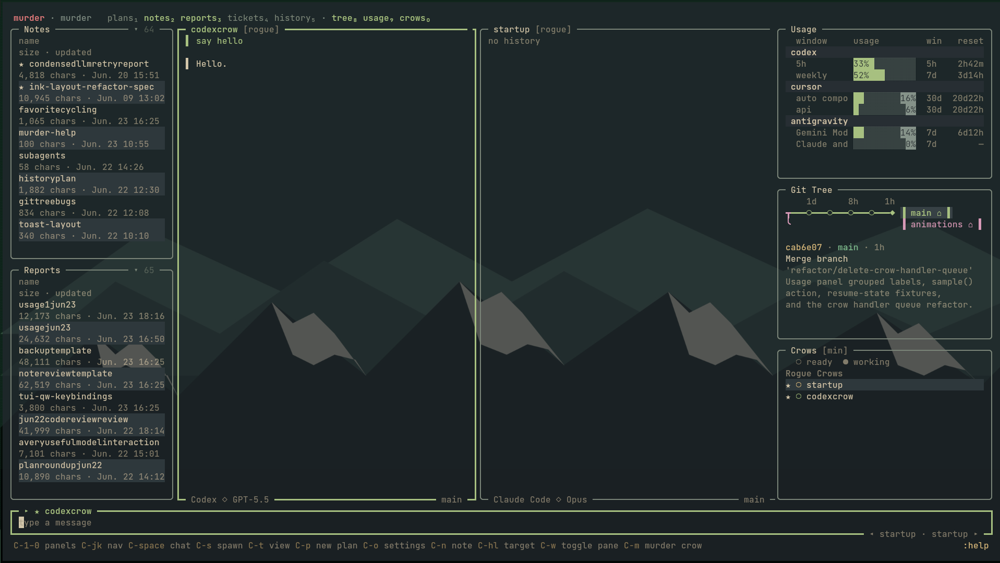
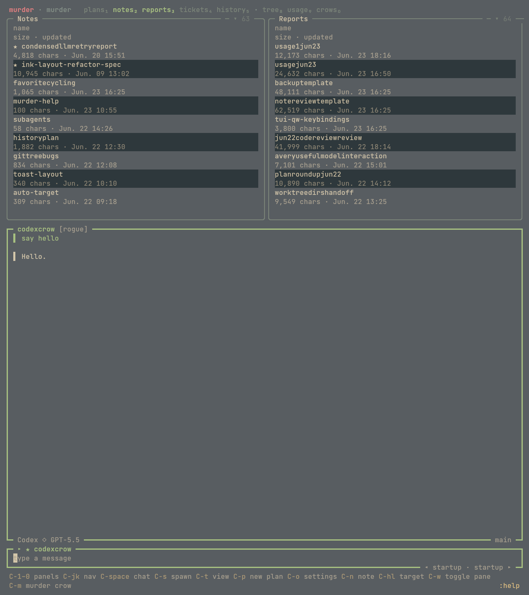

# murder

Multi-agent AI development harness for running Claude Code, Codex, Cursor, and other coding agents side-by-side from your terminal or browser.

`murder` gives a project its own agent workspace, tmux sessions, ticket/plan files, and terminal UI so you can supervise multiple coding agents without juggling separate shells.

## Screenshots



Wide terminal layout with notes, reports, active agent panes, usage, git history, and the crows roster visible at once.



Stacked terminal layout for narrower windows.

## Status

Early public release. The core workflow is usable, but the project is still moving quickly and some harness behavior depends on the vendor CLI versions installed on your machine.

## What It Does

- Launches and supervises multiple coding agents as "crows"
- Supports Claude Code, Codex, Cursor, Pi, and Antigravity harness adapters
- Provides an Ink-based terminal UI for plans, agents, tickets, history, usage, and transcripts
- Stores project-local runtime state under `.murder/`
- Includes optional web/mobile UI serving over a local WebSocket bridge
- Supports automated workflows. With one command, you can have Composer 2.5 gather a context brief for Claude, and have GPT review Claude's diff.
- Get a clean view of what your agents are doing in one centralized location 
- Runs preflight checks with `murder doctor`

## Requirements

- Python 3.10+
- Node.js 20+
- tmux
- git
- At least one supported coding-agent CLI on your `PATH` for your configured harnesses
- At least one LLM provider key for API-backed roles, such as `GROQ_API_KEY`, `CEREBRAS_API_KEY`, `ANTHROPIC_API_KEY`, `OPENAI_API_KEY`, or `OPENROUTER_API_KEY`

## Install

```bash
pip install murder
```

For the optional web UI bridge:

```bash
pip install "murder[web]"
```

From a source checkout:

```bash
uv sync
```

## Quickstart

In the git repo you want agents to work on:

```bash
murder init
```

This creates `.murder/`, seeds the local database, writes `.murder/roles.yaml`, and adds runtime files to `.gitignore`.

Add provider keys to `.murder/.env`, your repo-root `.env`, or `~/.config/murder/.env`:

```bash
GROQ_API_KEY=...
ANTHROPIC_API_KEY=...
```

Check the environment:

```bash
murder doctor
```

Launch the TUI:

```bash
murder
```

## Common Commands

```bash
murder init              # scaffold .murder/ in the current repo
murder doctor            # check tmux, node, git, config, harnesses, keys, and DB
murder up                # start the background runtime
murder down              # stop the background runtime
murder status            # show runtime status
murder ticket create "Fix the bug"  # create a ticket
murder web up            # serve the optional web/mobile UI
```

## TUI Shortcuts

- `?` - help overlay
- `alt+s` - spawn a crow
- `alt+p` - create a plan
- `ctrl+1` to `ctrl+5` - switch panels
- `:help` - list commands
- `/...` - pass a slash command to the active harness

Shortcuts can be changed from the in-app settings.

## Configuration

Project configuration lives in `.murder/roles.yaml`. The default scaffold configures:

- `collaborator` and `planner` as harness-backed roles
- `notetaker` and `crow_handler` as API-backed roles
- `default_crow` as the harness used for new crows

Edit `.murder/roles.yaml` to choose harnesses, model names, startup prompts, and per-role behavior.

## Development

See [CONTRIBUTING.md](CONTRIBUTING.md) for local setup, test philosophy, and repository layout.

Useful checks:

```bash
uv run ruff check .
uv run ruff format .
uv run mypy --strict murder/
uv run pytest
```

## License

See [LICENSE](LICENSE), [BRANDING.md](BRANDING.md), and
[LICENSES/NOTICE.md](LICENSES/NOTICE.md) for the full scoped terms.

- Code and project documentation: MIT
- JetBrains Mono font files, if vendored or bundled into package artifacts:
  OFL-1.1
- Project name, logo, wordmark, crow artwork, and related brand assets: owned
  by Luke Askew and not licensed under MIT; truthful, non-misleading references
  are permitted
