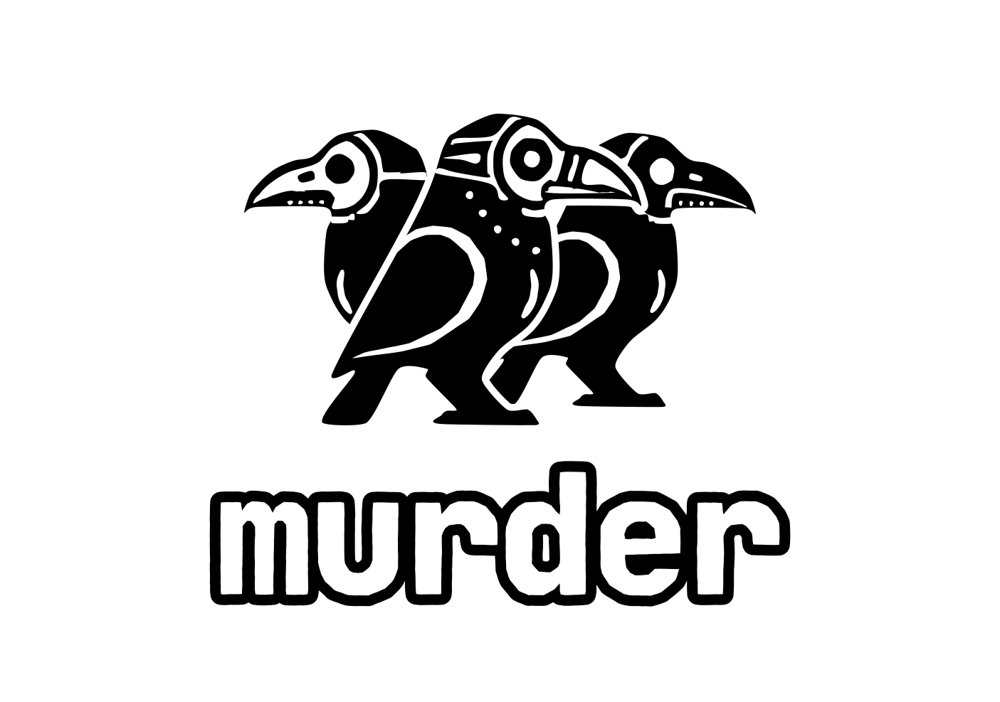

<p align="center">
  
</p>

<p align="center">
  <strong>A multi-agent dev harness: a murder of coding crows working on your project.</strong>
</p>


## What is Murder?

`murder` is a your crow's nest for running multiple coding agents at once.

It gives your project its own `.murder/` workspace for your agent generated files, prompts and worktrees; tmux-backed agent sessions, runtime state, a terminal UI that lets you watch the flock work without juggling a dozen separate shells, and an optional mobile friendly web UI to check in on your agents while on the go.

Use it to run Claude Code, Codex, Cursor, Pi, and Antigravity,  side-by-side, managing your usage across harnesses. (Other harness support coming soon!)

## Why is Murder?

Coding agents are useful, but the most useful models deplete your usage limits and budget quickly. Murder makes it easy to get useful work out of cheap tokens, whether it's for coding tasks where they suffice, or to increase the information density of tokens consumed by more expensive models and humans.

## Features
<table>
  <tr>
    <td width="33%" valign="top">
      
      <h4>Fire and Forget Workflows</h4>
      <p>Have a cheap model read widely to prepare token-efficient context for the Claude who implements the feature before Codex reviews the diff, all with one command.</p>
      <p> Murder stores your promptfu and templates to make the workflow quick to invoke, then handles spinning up new agents and <strong>context handoffs</strong>.</p>
    </td>
    <td width="33%" valign="top">
      
      <h4>Track and Conserve Usage</h4>
      <p> View your remaining usage across all usage windows for all of your harnesses in one place.</p>
      <p> <strong>Crow Magic</strong> can pace routine crow work against that data, keeping quota in reserve so you can access the model you trust most when you want to plan the architecture for a new feature, or do damage control when a cheaper agent flies too close to the sun.</p>
    </td>
    <td width="33%" valign="top">
      
      <h4>Observability for Active Agents</h4>
      <p>See which crows are blocked, idle, and working at a glance, so agents aren't lost to tiny terminal splits or window-manager archaeology.</p>
      <p> <strong>Abridged transcripts</strong> collapse tool spam and repeated shell output into the part worth reading, with final answers always shown verbatim and the unabridged version accessible by pressing <code>t</code>.</p>
    </td>
  </tr>
</table>


## Quickstart


```bash
git clone https://github.com/lukeask/murder.git
cd murder
```

```bash
uv tool install .
#or
pip install .
```

Check that your machine has what Murder needs:

```bash
murder doctor
```

Then open the TUI in the repo you want agents to work on:

```bash
cd /path/to/your/project
murder
```

First run in a repo scaffolds `.murder/` if it isn't there yet.

## Screenshots

### Full cockpit


Wide terminal layout with notes, reports, active agent panes, usage, git history, and the crows roster visible at once.

### Narrower terminal


Stacked layout for narrower windows.

## Status

Early public pre-release.

The core workflow is usable, but the project is still moving quickly. TUI support is first class, and the mobile friendly web UI is functional but has some quirks (improvements coming soon!) Some behavior depends on the vendor CLI versions installed on your machine.


## Supported harnesses

Current adapters include:

- Claude Code
- Codex
- Cursor
- Pi
- Antigravity

Configure which harnesses and models to use in `.murder/roles.yaml` or in the TUI settings menu.

## Requirements

- Python 3.10+
- Node.js 20+
- `tmux`
- `git`
- At least one supported coding-agent CLI on your `PATH`
- At least one LLM provider key for API-backed roles

Keys can be added via environment variables, or in the TUI settings menu.

Supported provider-key locations:

```text
.env
~/.config/murder/.env
```

Example keys:


```bash
GROQ_API_KEY=...
CEREBRAS_API_KEY=...
ANTHROPIC_API_KEY=...
OPENAI_API_KEY=...
OPENROUTER_API_KEY=...
```

> **Tip:** Groq and Cerebras both offer free-tier inference. Murder is built around their free model offerings — either key (or both) is enough to run API-backed roles without a paid provider elsewhere.

## Development

See [CONTRIBUTING.md](CONTRIBUTING.md) for local setup, test philosophy, and repository layout.

```bash
uv run ruff check .
uv run ruff format .
uv run mypy --strict murder/
uv run pytest
```

## License and branding

See [LICENSE](LICENSE), [BRANDING.md](BRANDING.md), and [LICENSES/NOTICE.md](LICENSES/NOTICE.md) for the full scoped terms.

- Code and project documentation: MIT
- JetBrains Mono font files, if vendored or bundled into package artifacts: OFL-1.1
- Project name, logo, wordmark, crow artwork, mascot artwork, and related brand assets: owned by Luke Askew and not licensed under MIT; truthful, non-misleading references are permitted
